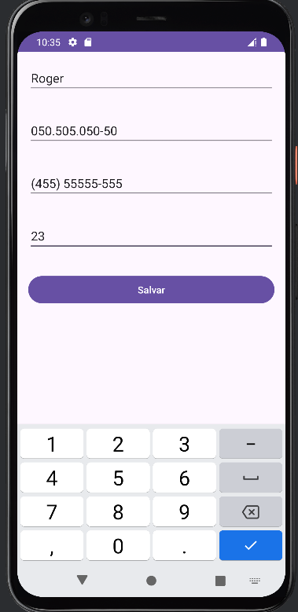
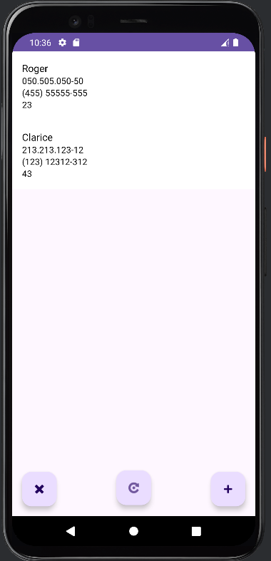

# Aplicativo de Gerenciamento de Estudantes

### **Título:** Aplicativo de Gerenciamento de Estudantes    
**Apresentador:** Roger Palma 

##  Objetivo 
- Utilizar `SQLite` para armazenamento local de dados de forma eficiente.
- Utilizar funcionalizadas do `AndroidStudio(java)`

## Funcionalidades Principais 
1. **Adicionar Estudante:** Inclusão de novos estudantes com validação de dados.
2. **Editar Estudante:** Atualização das informações existentes.
3. **Excluir Estudante:** Remoção de um ou mais estudantes com confirmação.
4. **Visualização da Lista:** Exibição organizada dos estudantes em um `RecyclerView`.
5. **Atualização Automática:** Sincronização em tempo real das alterações feitas na lista.

## Estrutura do Código
- **MainActivity.java:** Gerencia a interface principal e as operações de adição, edição e exclusão.
- **AddEditStudentActivity.java:** Responsável pela adição e edição de estudantes.
- **StudentDatabaseHelper.java:** Gerencia as operações do banco de dados SQLite.
- **StudentAdapter.java:** Exibe e gerencia a seleção de estudantes no `RecyclerView`.

## Detalhes do `MainActivity.java` 
- Exibe a lista de estudantes.
- Gerencia a navegação para adicionar ou editar um estudante.
- Funções principais:
  - `onCreate`: Inicializa interface e configurações.
  - `deleteSelectedStudents`: Exclui os estudantes selecionados.
  - `refreshStudentList`: Atualiza o `RecyclerView` com a lista atualizada.

## Detalhes do `AddEditStudentActivity.java`  
- Gerencia adição e edição de estudantes.
- Valida entrada de dados (CPF, telefone, idade).
- Funções principais:
  - `saveStudent`: Salva ou atualiza dados no banco de dados.
  - `validateInput`: Verifica a validade dos dados inseridos.
  - `loadStudentData`: Carrega dados do estudante para edição.

## Detalhes do `StudentDatabaseHelper.java`
**Título:** `StudentDatabaseHelper.java`  
- Gerencia o banco de dados SQLite.
- Operações principais:
  - `addStudent`: Insere novo estudante.
  - `updateStudent`: Atualiza dados do estudante.
  - `deleteStudent`: Remove estudante do banco.
  - `getAllStudents`: Recupera todos os registros.

## Detalhes do `StudentAdapter.java`
**Título:** `StudentAdapter.java`  
- Exibe lista no `RecyclerView`.
- Gerencia a seleção de estudantes.
- Funções principais:
  - `onBindViewHolder`: Vincula dados de cada estudante à interface.
  - `getSelectedStudents`: Retorna estudantes selecionados.
  - `clearSelection`: Limpa seleção após operação.

## Demonstração do Aplicativo 
 

  
  

## Conclusão
**Título:** Conclusão  
- Resumo das funcionalidades.
- Otima demonstração das funcionalidades
- Próximos passos: Possíveis melhorias e funcionalidades futuras.

---

## Perguntas e Respostas
- Abertura para perguntas da audiência.
