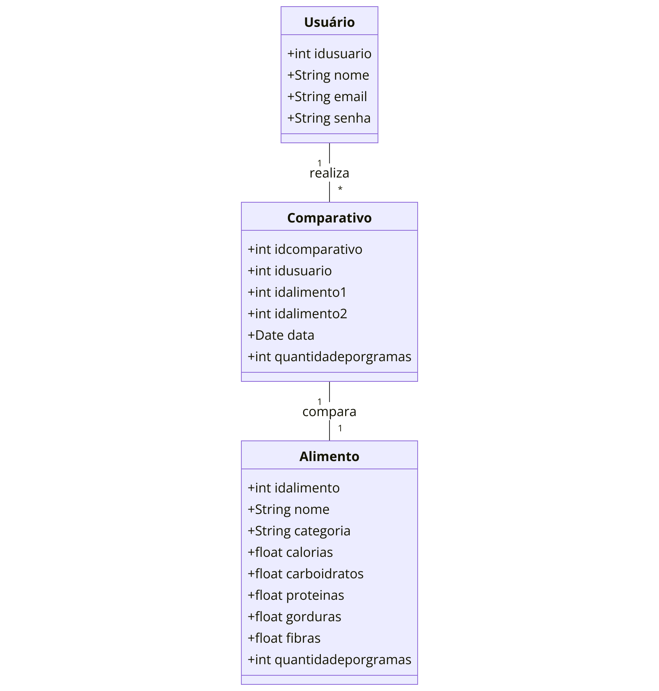

# NutriComp - Comparador de Alimentos Nutricionais

**Autor:** Roger da Palma

## Objetivo Geral

O aplicativo visa facilitar a comparação nutricional de diversos alimentos, como arroz, feijão, frutas, legumes, entre outros, com base nas necessidades específicas dos usuários. Além disso, exibirá embaixo da comparação inicial alimentos alternativos que sejam boas substituições nutricionais para o alimento escolhido, ajudando os usuários a encontrarem opções mais saudáveis ou adequadas às suas necessidades.

## Justificativa

Este aplicativo é importante para pessoas que desejam melhorar a alimentação, atletas, pessoas em dietas especiais e indivíduos que precisam monitorar sua ingestão de nutrientes. A possibilidade de comparar alimentos e ver sugestões de substituições ajuda a tomar decisões mais conscientes sobre a alimentação.

## Funcionalidades Principais

- Cadastro de usuários para personalização das comparações.
- Exibição de informações nutricionais detalhadas (calorias, proteínas, carboidratos, gorduras, etc.).
- Comparação de diferentes alimentos, ajustável para diferentes porções (ex.: 100g, 200g).
- Exibição de alternativas nutricionalmente similares ao alimento escolhido.
- Histórico de comparações para consulta futura.
- Filtragem de alimentos por categoria (ex.: grãos, vegetais, proteínas).
- Integração futura de geolocalização para encontrar alimentos saudáveis próximos.

## Banco de Dados

Será utilizado SQLite, uma solução de banco de dados local eficiente e leve. A escolha é justificada por ser suficiente para armazenar dados nutricionais e informações de usuários sem a necessidade de uma conexão com a internet.

## Modelagem do Banco de Dados

### Entidades:

- Usuário: `idusuario`, `nome`, `email`, `senha`.
- Alimento: `idalimento`, `nome`, `categoria`, `calorias`, `carboidratos`, `proteínas`, `gorduras`, `fibras`, `quantidadeporgramas`.
- Comparativo: `idcomparativo`, `idusuario`, `idalimento1`, `idalimento2`, `data`, `quantidadeporgramas`.

### Usuário

| Atributo  | Tipo    |
|-----------|---------|
| idusuario | int     |
| nome      | String  |
| email     | String  |
| senha     | String  |

**1** realiza **\*** comparativos

### Comparativo

| Atributo            | Tipo    |
|---------------------|---------|
| idcomparativo        | int     |
| idusuario            | int     |
| idalimento1          | int     |
| idalimento2          | int     |
| data                | Date    |
| quantidadeporgramas  | int     |

**1** compara **1** alimentos

### Alimento

| Atributo            | Tipo    |
|---------------------|---------|
| idalimento          | int     |
| nome                | String  |
| categoria           | String  |
| calorias            | float   |
| carboidratos        | float   |
| proteinas           | float   |
| gorduras            | float   |
| fibras              | float   |
| quantidadeporgramas | int     |

### Relacionamentos

- **Usuário** (1) realiza (muitos) **Comparativos**.
- **Comparativo** (1) compara (1) **Alimento**.

### Relações:

- Cada usuário pode realizar vários comparativos.
- Cada comparativo envolve dois alimentos principais.
- A tabela de alimentos também será utilizada para sugerir substituições nutricionais.

## Metodologia Ágil

Scrum será utilizado devido à sua flexibilidade e ao foco em entregas incrementais, permitindo ajustes rápidos durante o desenvolvimento do aplicativo, que requer testes constantes e melhorias iterativas.

## Implementação da Metodologia

- **Sprints:** Ciclos de 2 semanas para entrega de funcionalidades.
- **Reuniões diárias:** Check-ins para garantir que o progresso está em dia.
- **Kanban:** Organização visual das tarefas e do backlog de desenvolvimento.
- **Backlog:** Lista de funcionalidades a serem implementadas com prioridade.

## Design e UX

### Wireframes incluirão:

- Tela de login/cadastro.
- Tela de listagem de alimentos.
- Tela de comparação entre dois alimentos, com gráfico de barras para exibição das diferenças nutricionais.
- Exibição, logo abaixo da comparação, de alimentos sugeridos como substituições.
- Tela de histórico de comparações.

## Experiência do Usuário (UX)

- **Simplicidade:** Interfaces limpas e intuitivas.
- **Navegação fluida:** Fácil acesso às funcionalidades e exibição clara dos dados.
- **Feedback visual:** O usuário receberá respostas imediatas a cada ação realizada.

## Ferramentas e Tecnologias Utilizadas

- **IDE:** Android Studio.
- **Linguagem:** Java.
- **Banco de Dados:** SQLite.
- **Bibliotecas:** Retrofit e Room.

## Planejamento de Entregas

| Sprint   | Descrição                                                    | Duração   |
|----------|---------------------------------------------------------------|-----------|
| Sprint 1 | Modelagem do banco de dados e implementação da tela de cadastro| 2 semanas |
| Sprint 2 | Implementação da tela de listagem de alimentos e funcionalidade de comparação | 2 semanas |
| Sprint 3 | Ajuste dinâmico de porções e exibição de alternativas nutricionais | 2 semanas |
| Sprint 4 | Melhorias de design e ajustes de UX | 2 semanas |

## Considerações Finais

### Desafios Esperados:

- Implementação eficiente da comparação de porções dinâmicas e exibição de substituições nutricionais.
- Otimização da interface para clareza, mesmo com muitos dados.

### Possíveis Melhorias:

- Dicas de alimentação e substituições saudáveis.
- Integração com APIs nutricionais.
- Geolocalização para sugerir alimentos saudáveis.

## Referências

- [https://www.sqlite.org/docs.html](https://www.sqlite.org/docs.html)
- [https://developer.android.com/studio](https://developer.android.com/studio)
- [https://developer.android.com/guide](https://developer.android.com/guide)
- [https://www.myfitnesspal.com](https://www.myfitnesspal.com)
- [https://www.fooducate.com](https://www.fooducate.com)
- [https://fdc.nal.usda.gov](https://fdc.nal.usda.gov)
- [https://www.redalyc.org/journal/6257/625767707007/html/](https://www.redalyc.org/journal/6257/625767707007/html/)
- [https://www.scrum.org](https://www.scrum.org)
- [https://www.agilealliance.org](https://www.agilealliance.org)
- [https://developer.android.com/](https://developer.android.com/)
- [https://docs.oracle.com/javase/](https://docs.oracle.com/javase/)
- [https://www.nngroup.com](https://www.nngroup.com)
