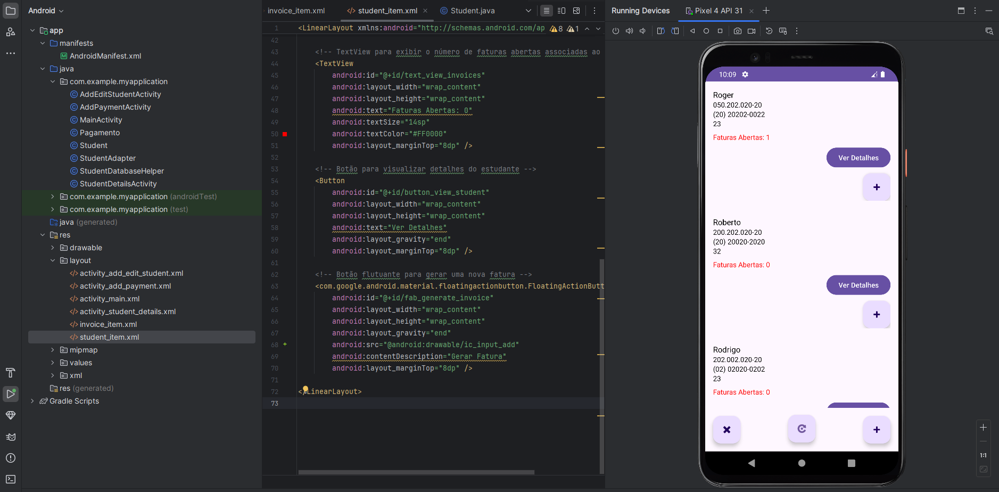
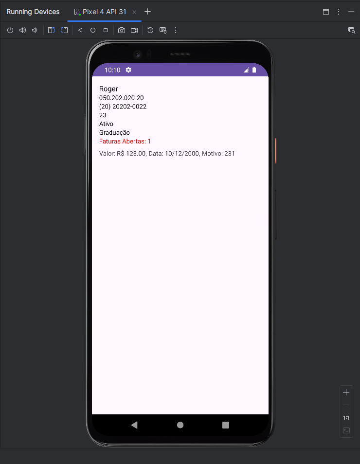
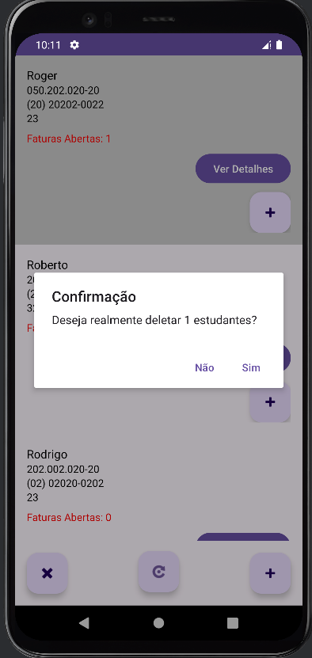

# TRABALHO PRODUTO DE APRENDIZAGEM CRUD
## Autor : Roger da Palma
O **Trabalho** em questão é um aplicativo Android projetado para gerenciar informações de estudantes e seus pagamentos de faturas. Ele permite que os usuários adicionem, editem e visualizem detalhes de estudantes, além de gerenciar faturas associadas a cada estudante, incluindo a capacidade de visualizar faturas abertas e adicionar novos pagamentos.

## Objetivo do Projeto

O objetivo deste projeto é desenvolver um aplicativo Android que:
- Gerencie informações básicas dos estudantes, como nome, CPF, telefone, idade, status de atividade e tipo de curso.
- Permita o gerenciamento de faturas associadas a cada estudante, incluindo o registro de novos pagamentos e a visualização de faturas abertas.
- Facilite a navegação entre as telas de listagem de estudantes, detalhes do estudante e adição de pagamentos.

## Funcionalidades Implementadas

1. **Listagem de Estudantes**: Exibe uma lista de todos os estudantes registrados, incluindo suas informações básicas e o número de faturas abertas.

   
2. **Visualização de Detalhes do Estudante**: Mostra informações detalhadas de um estudante específico, incluindo todas as faturas associadas e seu status.

   
3. **Adição e Edição de Estudantes**: Permite a adição de novos estudantes e a edição dos detalhes existentes.
   
4. **Exclusão de Estudantes**: Permite excluir ou deixar o estudante inativo.

5. **Gerenciamento de Faturas**: Exibe todas as faturas associadas a um estudante, permitindo adicionar novas faturas e visualizar o status das existentes (pagas ou abertas).

## Bibliotecas e Ferramentas Utilizadas

- **Android SDK**: Framework principal para o desenvolvimento do aplicativo Android.
- **SQLite**: Banco de dados local utilizado para armazenar informações de estudantes e faturas.
- **Android RecyclerView**: Utilizado para exibir listas de dados de forma eficiente e com capacidade de rolagem (como `ListView` e `GridView`).
- **textViewName**: Exibindo mensagens das validações e etc! (textAlert).
- **Android Room**: Poderia ser usado para simplificar operações de banco de dados, mas neste projeto utilizamos `SQLiteOpenHelper` para manipular diretamente o banco de dados SQLite.

## Arquitetura do Projeto

O projeto segue uma arquitetura MVC simplificada:

- **Model**: Classes que representam a estrutura dos dados, como `Student` e `Pagamento`.
- **View**: XML Layouts que definem a interface do usuário, como `activity_main.xml`, `student_item.xml`, etc.
- **Controller**: Atividades Android (`MainActivity`, `StudentDetailsActivity`, `AddEditStudentActivity`, `AddPaymentActivity`) e adaptadores (`StudentAdapter`) que controlam a lógica da interface do usuário e a interação com o banco de dados.

## Detalhes do Código

### 1. **Classes de Atividade (Activities)**

- **MainActivity.java**: A atividade principal que carrega e exibe a lista de estudantes usando o `RecyclerView` e `StudentAdapter`.
- **StudentDetailsActivity.java**: Exibe os detalhes de um estudante específico e todas as suas faturas. Permite a adição de novas faturas.
- **AddEditStudentActivity.java**: Permite adicionar um novo estudante ou editar um existente.
- **AddPaymentActivity.java**: Permite adicionar uma nova fatura para um estudante.

### 2. **Adaptadores (Adapters)**

- **StudentAdapter.java**: Adapta os dados dos estudantes para serem exibidos em um `RecyclerView`. Inclui lógica para contar e exibir o número de faturas abertas de cada estudante.

### 3. **Banco de Dados (Database)**

- **StudentDatabaseHelper.java**: Gerencia a criação, atualização e manipulação de dados no banco de dados SQLite. Contém métodos para adicionar, editar, excluir e recuperar estudantes e faturas.

### 4. **Modelos de Dados (Data Models)**

- **Student.java**: Modelo de dados para armazenar informações do estudante.
- **Pagamento.java**: Modelo de dados para armazenar informações de pagamento (faturas).

### 5. **Layouts XML**

- **activity_main.xml**: Layout para a tela principal que exibe a lista de estudantes.
- **activity_student_details.xml**: Layout para a tela de detalhes do estudante.
- **activity_add_edit_student.xml**: Layout para adicionar ou editar informações do estudante.
- **activity_add_payment.xml**: Layout para adicionar uma nova fatura.
- **student_item.xml**: Layout para cada item da lista de estudantes no `RecyclerView`.

## Dificuldades

- **Identificar erros no código**: Muitas das vezes os erros não exibiam crashes, sendo necessário consultar os logs para rastrear o erro cometido.
- **Exibição de faturas registradas (Utilizar duas tabelas em uma só)**: Foi custoso, pois muitas vezes não eram exibidas no local certo ou nem eram exibidas.
- **Versão do banco**: Às vezes era esquecido de trocar a versão do banco, causando um crash sem "motivo" aparente.

## Melhorias Futuras

- **Autenticação de Usuário**: Implementar autenticação para diferentes níveis de acesso.
- **Notificações**: Adicionar notificações para faturas vencidas ou eventos importantes, além de adicionar prazos para as faturas.
- **Testes Automatizados**: Implementar testes unitários e de interface do usuário para garantir a qualidade do código.
- **Atualizar as faturas na lista de todos os alunos**: Não está atualizando diretamente como deveria.
- **Melhorias no design**: Alterar as cores padrão do código para ficarem mais alinhadas com a identidade visual do projeto.

## Contribuições

Contribuições são bem-vindas! Sinta-se à vontade para abrir uma issue ou enviar um pull request.
